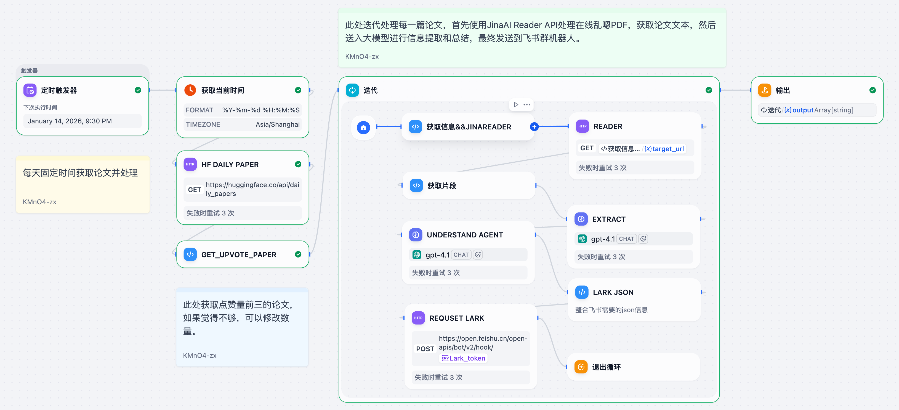
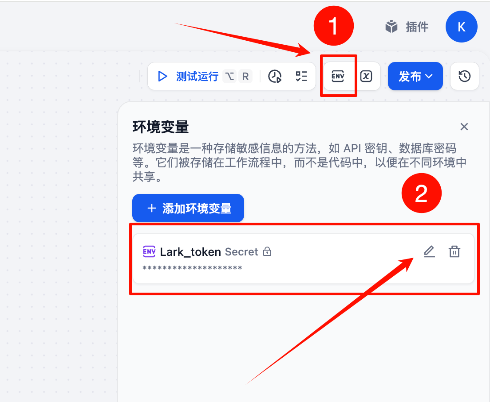
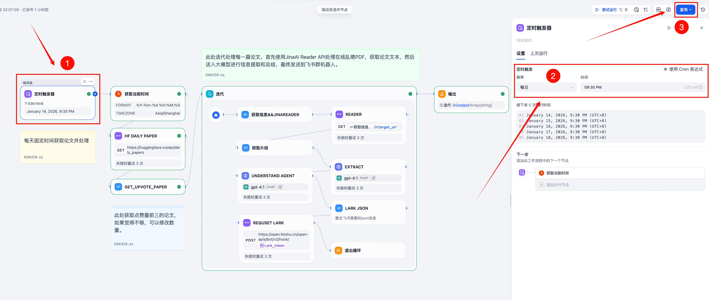
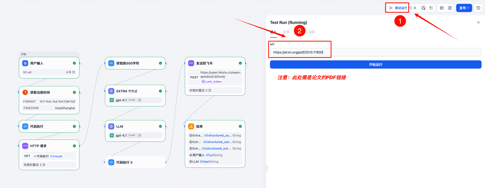
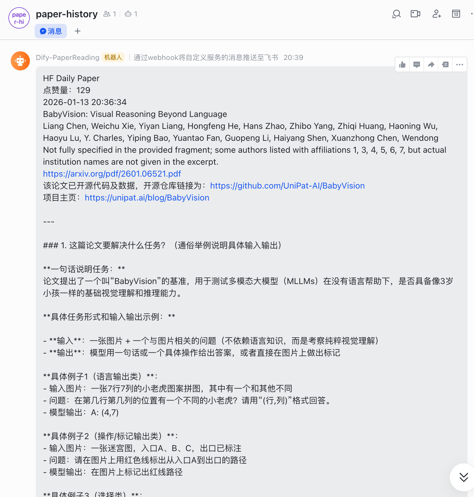

# Paper-Workflow

&emsp;&emsp;[HF-DailyPaper](./workflow/HF-DailyPaper.yml) 和 [ReadingPaper-Lark](./workflow/ReadingPaper-Lark.yml) 是我经常用来阅读论文的两个 Dify Workflow。HF-DailyPaper 用于每天固定时间获取 [HuggingFace DailyPaper](https://huggingface.co/papers/) 当天点赞量最多的三篇论文，并生成论文速览笔记，与飞书机器人联动；ReadingPaper-Lark 用于快速阅读和理解指定的论文内容，并生成详细的笔记，与飞书机器人联动。

## HF-DailyPaper

&emsp;&emsp;使用 Dify 工作流的触发器功能，设置每天定时触发。工作流会自动访问 HuggingFace DailyPaper 页面，获取当天点赞量最高的三篇论文的标题、作者、摘要和链接。然后使用大模型生成每篇论文的速览笔记，包含论文代码是否开源、论文解决的问题、论文使用的评估指标及论文相比 Baseline 的优势等内容。最后通过飞书机器人将生成的论文速览笔记发送到指定的飞书群组。

    
    
HF-DailyPaper

## ReadingPaper-Lark

&emsp;&emsp;ReadingPaper-Lark 工作流允许用户输入指定论文的 PDF 在线链接，然后工作流会自动调用 [JinaAI Reader](https://jina.ai/reader/) API 解析 PDF 文件，并使用大模型对论文内容进行分析和理解。工作流会生成详细的论文笔记，包含论文代码是否开源、论文解决的问题、论文使用的评估指标及论文相比 Baseline 的优势等内容。最后通过飞书机器人将生成的论文笔记发送到指定的飞书群组。

    
    
ReadingPaper-Lark

## Quick Start

1. 注册并登录 [Dify](https://www.dify.ai/) 账号。

2. 创建飞书机器人，并获取机器人的 Webhook Token。参考文档：[创建自定义机器人](https://www.feishu.cn/hc/zh-CN/articles/360024984973-%E5%9C%A8%E7%BE%A4%E7%BB%84%E4%B8%AD%E4%BD%BF%E7%94%A8%E6%9C%BA%E5%99%A8%E4%BA%BA)。***飞书是允许单人群组的，所以你可以创建一个只有你自己的飞书群组来接收消息。***

3. 将本仓库的[工作流文件](./workflow/)导入到 Dify 工作流中。参考文档：[导入和导出工作流](https://docs.dify.ai/zh/use-dify/workspace/app-management#%E5%AF%BC%E5%85%A5%E5%BA%94%E7%94%A8%E7%A8%8B%E5%BA%8F)。

4. 在工作流中配置飞书机器人的 Webhook Token。

    

5. 如是 HF-DailyPaper，则配置并启动 HF-DailyPaper 工作流的定时触发器，设置每天固定时间触发。

    

6. 如是 ReadingPaper-Lark，则启动 ReadingPaper-Lark 工作流，并在输入框中输入论文 PDF 的在线链接。

    

7. 等待工作流运行完成，即可在飞书群组中收到论文笔记消息。

    

## License
This project is licensed under the Apache 2.0 License. See the [LICENSE](./LICENSE) file for details.
